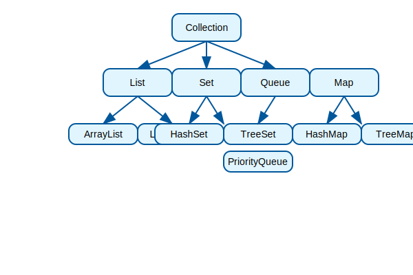

# Java Collections, A Deep Dive

Welcome to this comprehensive guide on Java Collections! If you're a Java developer, you've likely encountered collections in your code. But do you truly understand the power and intricacies of the Java Collections Framework? Let's dive deep into this essential part of Java programming.

## What are Java Collections?

Java Collections are a set of classes and interfaces that provide a unified architecture for storing and manipulating groups of objects. Introduced in Java 1.2, the Collections Framework revolutionized how Java developers handle data structures.

The framework is built around several key interfaces: `Collection`, `List`, `Set`, `Queue`, and `Map`. Each serves a specific purpose and comes with multiple implementations optimized for different use cases.



## The Collection Interface

At the root of the framework is the `Collection` interface. It defines the basic operations that all collections support:

- `add(E e)` - Adds an element
- `remove(Object o)` - Removes an element
- `size()` - Returns the number of elements
- `isEmpty()` - Checks if the collection is empty
- `contains(Object o)` - Checks if an element exists

## List Interface: Ordered Collections

Lists are ordered collections that allow duplicate elements. They're perfect when you need to maintain insertion order or access elements by index.

### ArrayList
The most commonly used List implementation. It's backed by a dynamic array, making it great for random access but slower for insertions/deletions in the middle.

```java
List<String> names = new ArrayList<>();
names.add("Alice");
names.add("Bob");
names.get(0); // Fast random access
```

### LinkedList
Implemented as a doubly-linked list. Excellent for frequent insertions and deletions, but slower for random access.

```java
List<String> tasks = new LinkedList<>();
tasks.addFirst("High Priority");
tasks.addLast("Low Priority");
```

## Set Interface: Unique Elements

Sets store unique elements and provide fast lookup operations. No duplicates allowed!

### HashSet
Backed by a hash table. Offers constant-time performance for basic operations.

```java
Set<String> uniqueWords = new HashSet<>();
uniqueWords.add("hello");
uniqueWords.add("hello"); // Duplicate, ignored
```

### TreeSet
Maintains elements in sorted order. Useful when you need ordered unique elements.

```java
Set<Integer> sortedNumbers = new TreeSet<>();
sortedNumbers.add(5);
sortedNumbers.add(1);
sortedNumbers.add(3);
// Elements: 1, 3, 5
```

## Queue Interface: FIFO Operations

Queues follow First-In-First-Out (FIFO) principle. Perfect for processing elements in order.

### PriorityQueue
Elements are ordered by priority, not insertion order.

```java
Queue<Task> taskQueue = new PriorityQueue<>(Comparator.comparing(Task::getPriority));
taskQueue.add(new Task("Low", 3));
taskQueue.add(new Task("High", 1));
```

## Map Interface: Key-Value Pairs

Maps store key-value associations. Keys must be unique, values can be duplicated.

### HashMap
The go-to Map implementation. Fast lookups, but no ordering guarantee.

```java
Map<String, Integer> wordCount = new HashMap<>();
wordCount.put("hello", 1);
wordCount.put("world", 2);
```

### TreeMap
Maintains keys in sorted order.

```java
Map<String, String> dictionary = new TreeMap<>();
dictionary.put("apple", "a fruit");
dictionary.put("zebra", "an animal");
```

## Choosing the Right Collection

- **Need ordered collection with duplicates?** → List
- **Need unique elements only?** → Set
- **Need key-value pairs?** → Map
- **Processing in order?** → Queue
- **Fast random access?** → ArrayList
- **Frequent insertions/deletions?** → LinkedList
- **Sorted elements?** → TreeSet or TreeMap

## Best Practices

1. **Use interfaces, not implementations**: Program to `List`, not `ArrayList`
2. **Choose the right implementation**: Consider your access patterns
3. **Watch for concurrency**: Use thread-safe versions when needed
4. **Consider generics**: Always specify types for type safety

## Conclusion

The Java Collections Framework is a powerful tool that every Java developer should master. By understanding the different interfaces and their implementations, you can write more efficient and maintainable code.

Remember, the key to effective programming is not just knowing how to use collections, but knowing when and why to use each one. Happy coding!

*What collection challenges have you faced? Share in the comments below!* 